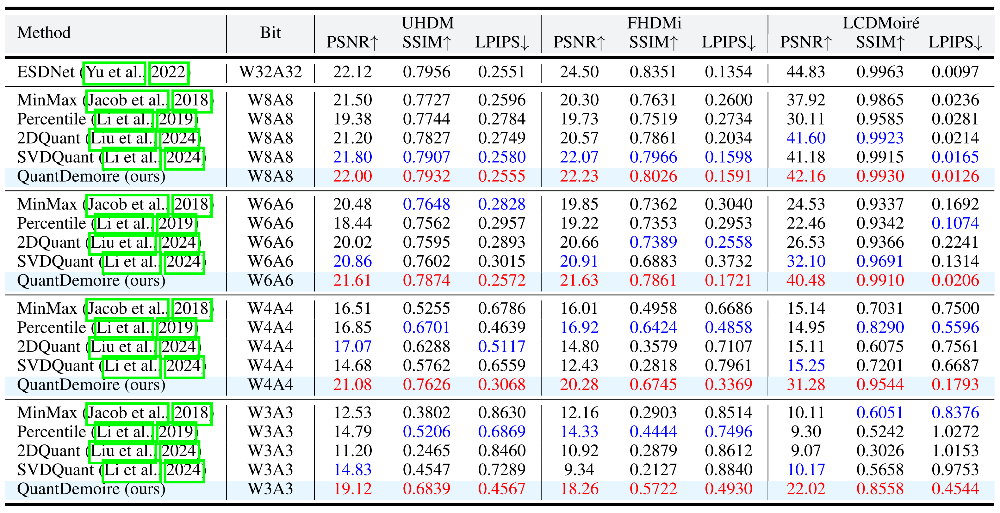
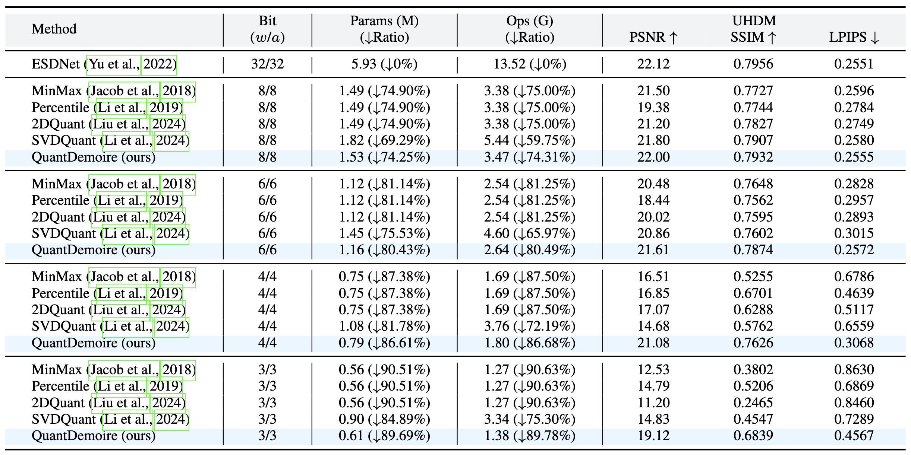

# QuantDemoire: Quantization with Outlier Aware for Image Demoiréing
[Zheng Chen](https://zhengchen1999.github.io/), [Kewei Zhang](https://github.com/Pushazf), [Xiaoyang Liu](https://xyliu339.github.io/), [Weihang Zhang](), [Mengfan Wang](), [Yifan Fu](), [Yulun Zhang](http://yulunzhang.com/),"QuantDemoire: Quantization with Outlier Aware for Image Demoiréing", arXiv, 2025

[[project]()] [[paper]()] [[supplementary material]()]

#### 🔥🔥🔥 News

- **2025-10-05:** This repo is released.

---

> **Abstract:** Demoiréing aims to remove moiré artifacts that often occur in images. While recent deep learning-based methods have achieved promising results, they typically require substantial computational resources, limiting their deployment on edge devices. Model quantization offers a compelling solution. However, directly applying existing quantization methods to demoiréing models introduces severe performance degradation. The main reasons are distribution outliers and weakened representations in smooth regions. To address these issues, we propose QuantDemoire, a post-training quantization framework tailored to demoiréing. It contains two key components. **First**, we introduce an outlier-aware quantizer to reduce errors from outliers. It uses sampling-based range estimation to reduce activation outliers, and keeps a few extreme weights in FP16 with negligible cost. **Second**, we design a frequency-aware calibration strategy. It emphasizes low- and mid-frequency components during fine-tuning, which mitigates banding artifacts caused by low-bit quantization. Extensive experiments validate that our QuantDemoire achieves large reductions in parameters and computation while maintaining quality. Meanwhile, it outperforms existing quantization methods by over **4 dB** on W4A4.


## ⚒️ TODO

* [ ] Release code and pretrained models
* [ ] Test our quantization method on more models

## 🔎 Method Overview


## <a name="results"></a>🔎 Results

<details open>
<summary>Quantitative Results (click to expand)</summary>

- Results in Tab. 4 of the main paper

<p align="center">
  
</p>

- Results (Compression Ratio) in Tab. 3 of the supplementary material

<p align="center">
  
</p>

</details>

<details open>
<summary>Qualitative Results (click to expand)</summary>

- Results in Fig. 6 of the main paper

<p align="center">
  
</p>
<details>
<summary>More Qualitative Results</summary>

- More results in Fig. 1 of the supplementary material

<p align="center">
  
</p>

- More results in Fig. 2 of the supplementary material

<p align="center">
  
</p>

</details>

</details>

## <a name="citation"></a>📎 Citation

If you find the code helpful in your research or work, please cite our work.

```
```
